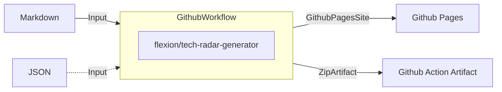

# Tech Radar Generator

##
A tech radar is a visual representation of the technology landscape within an organization. It helps teams and organizations track the technologies they use or are interested in, and make informed decisions about which technologies to adopt, hold, or retire. Tech radars are useful for both individuals and organizations to stay up-to-date with the latest trends, share knowledge, and facilitate communication about technology choices.


## Input Variables

| Name             | Description                                      | Required | Default             |
|------------------|--------------------------------------------------|----------|---------------------|
| directory        | Folder containing the tech radar data            | true     |                     |
| artifact_name    | Name of the artifact to upload (optional)        | false    |                     |
| publish_to_pages | Publish to Github Pages (optional)               | false    | "false"             |
| public_url       | Public URL used for rendering and publishing     | false    | "./build"           |
| radar_name       | Name of the radar (optional)                     | false    | "Flexion Tech Radar"|

## Example Usage

### Github Pages

```yaml

name: Tech Radar

on:
  push:
    branches: ['main']

# Sets permissions of the GITHUB_TOKEN to allow deployment to GitHub Pages
permissions:
  contents: read
  pages: write
  id-token: write

# Allow only one concurrent deployment, skipping runs queued between the run in-progress and latest queued.
# However, do NOT cancel in-progress runs as we want to allow these production deployments to complete.
concurrency:
  group: "pages"
  cancel-in-progress: false

jobs:
  generate_tech_radar:
    environment:
      name: github-pages
      url: ${{ steps.deployment.outputs.pages_url }}
    runs-on: ubuntu-latest
    steps:
      - name: Checkout
        uses: actions/checkout@v4

      - name: Generate Tech Radar
        id: deployment
        uses: flexion/tech-radar-generator@v0.1.3
        with:
          radar_name: My Radar
          directory: ./docs
          public_url: /tech-radar # Since Github Pages is used, only the path is needed
          publish_to_pages: 'true'

```

## Roadmap

- Add parameter for input format for the radar; Markdown is implied, under the AOE radar format "<version>/*.md", but JSON is also supported
- Parametrize radar engine; AOE Radar is implied
- Parametrize radar version
- Extract radar installation to a script
- Add more deployment targets


